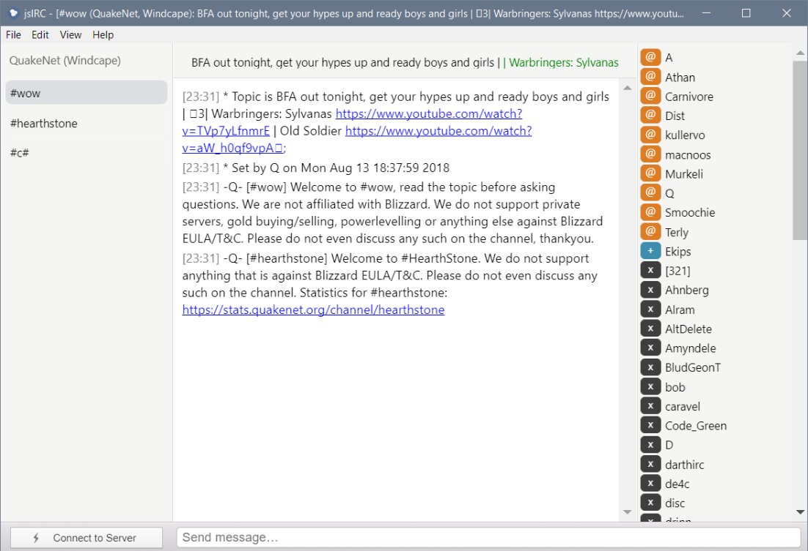

# jsIRC

A IRC client built in [Electron](https://electronjs.org) and [Node.js](https://nodejs.org/) on top of the [jsIRC](https://github.com/clausjoergensen/jsIRC) library.

# Notes

This project only been tested on Windows, but should run on MacOS and Linux as well.

# License

[MIT License](LICENSE.md)

# Acknowledgements

The project uses a range of Open Source components. 

* [electron](https://github.com/electron/electron)
* [node.js](https://github.com/nodejs/node)
* [photon](https://github.com/connors/photon)
* [inputhistory](https://github.com/erming/inputhistory)
* [autolinker](https://github.com/gregjacobs)
* [jquery](https://github.com/jquery/jquery)
* [pretty-ms](https://github.com/sindresorhus/pretty-ms)
* [strftime](https://github.com/thdoan/strftime)
